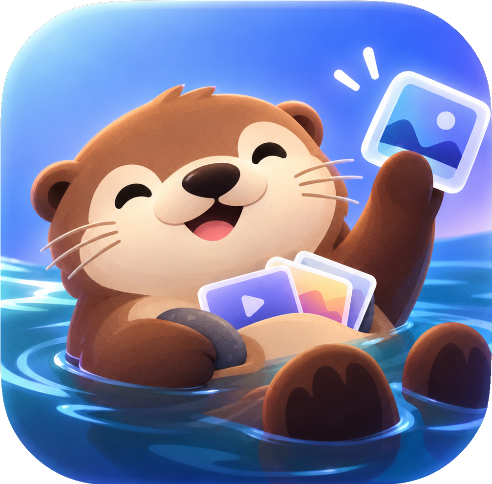

<p align="center"></p>

# ScreenOtter

A macOS menu bar app for screenshots and screen recordings. A sea otter keeps its favorite stone tucked under its arm; ScreenOtter keeps the things you capture.

- **Capture Area** (default `⌥⇧4`): crosshair, drag a rectangle, done. Full-bleed, no frame.
- **Capture Window** (default `⌥⇧5`): hover a window and click. The window keeps its rounded corners and sits on your desktop wallpaper with a very subtle shadow, ready for demos. Traffic lights are always in color: if the window was inactive, the gray ones are repainted.
- While selecting, **Space** switches between area and window mode and **Esc** cancels.
- Every capture is copied to the clipboard and saved to `~/Pictures/Screenshots` (configurable).
- A small thumbnail slides in at the bottom right: **click** to edit, **drag** into any app, or **swipe** it away.
- **Shelf** (default `⌥⇧D`, or shake the pointer while dragging files): a small floating glass panel that holds files for a moment. Drop screenshots on it (or click the tray button on the thumbnail), then drag the whole stack into a folder, a chat or a browser upload. Click the stack to see every file: Shift- or ⌘-click to select several and drag only those; Delete removes from the shelf, ⌘C copies, double-click opens. Recent shelves come back from the menu bar.
- The editor can crop, and draw arrows, lines, rectangles, circles and freehand. Copy (`⌘C`) or close the window to write the edits back to the file and the clipboard.
- **Text** (`T`): click to place a label and type in place. Return, Esc or a click away finishes it (Shift-Return for a new line); double-click (or select and press Return) to edit again, drag to move, drag the corner handle to resize. Three looks: plain text with a soft shadow, a filled label whose text turns black or white to contrast with the color, and an outlined label. Three bundled faces chosen for product shots: Geist (default), Plus Jakarta Sans and Geist Mono. The font and the look sit in the style chip, where the weights become text sizes.
- **Blur and pixelate** (`B`): drag over anything private. The region is redacted from the screenshot itself, so arrows and labels on top stay sharp, and its blocks scale with the region so the text inside can't be read back from the saved image. Soft continuous corners, flush with the edge when the region touches it. Drag to move, drag a corner or an edge to resize. Blur is the default; press `B` again, or use the style chip, to switch to pixelate (it applies to the selected region too).
- **Style**: one chip in the editor toolbar holds a short palette chosen to look good in a demo (coral, orange, amber, green, blue, violet, ink, white), a custom color, and four stroke weights. Keys `1`–`8` pick a color. With an annotation selected, the style changes that one (`⌘Z` undoes it). The last style you used becomes the default for the next screenshot.
- **Record Screen** (default `⌥⇧6`): drag an area, click to record the whole screen, or press Space and click a window. A 3-2-1 countdown runs first (Esc cancels; can be turned off). Click the timer in the menu bar, or press the shortcut again, to stop.
- The recording opens in its own editor, in the style of Screen Studio:
  - **Background**: wallpaper, gradients, solid colors or your own image, with padding, rounded corners, shadow, blur and an aspect ratio (Auto, 16:9, 4:3, 1:1, 9:16).
  - **Cursor**: redrawn by the editor, so it can be smoothed (on by default), resized, restyled, motion-blurred on fast moves, hidden when idle, with a ripple on every click.
  - **Zoom**: auto zoom eases in on clusters of clicks and follows the pointer, then eases back out. Click or drag on the zoom track to add your own; drag to move, drag the ends to resize.
  - **Clips**: drag the ends of a clip to trim, split at the playhead (`S`), delete a piece, and set each clip's speed (0.5× to 4×). Space plays, ← → step a frame, `⌘Z` undoes.
  - **Export** (`⌘E`): MP4 at 720p, 1080p, 1440p or 4K, saved to the screenshots folder (and copied as a file to the clipboard). The last style you used becomes the default for the next recording.
  - **Drafts**: every recording is a draft. Edits save as you go; the Drafts window (menu bar › Drafts › Show All Drafts…, Settings, or the stack button in the editor) lists them all to reopen, rename, duplicate or trash. They live in `~/Library/Application Support/ScreenOtter/Recordings`.

## Build & install

Requires macOS 14+ and Xcode 26 (Swift 6.2).

```sh
./scripts/build.sh            # builds build/ScreenOtter.app
./scripts/build.sh --install  # also copies it to /Applications and launches it
```

The build signs with your first code-signing identity (override with `SIGN_IDENTITY=...`) so the Screen Recording permission survives rebuilds.
The artwork lives in `Resources/Brand`. `swift scripts/make-icons.swift` turns it into the app icon (`Resources/AppIcon.icns`), the menu bar icon and the illustration the app uses.
The text tool's fonts live in `Resources/Fonts` (SIL Open Font License, licenses alongside) and are registered for the app only at launch.

ScreenOtter used to be called Screenshotta. It keeps the old bundle identifier, so permissions and settings carry over, and moves its data to `~/Library/Application Support/ScreenOtter` on first launch.

## Permissions

- **Screen Recording**: required, for screenshots and recordings. macOS asks on first launch; after granting it, quit and reopen the app.
- **Accessibility**: optional. Lets a window capture raise the exact window you clicked, so its traffic lights render in color.

## Layout

- `Sources/ScreenOtter/Capture`: selection overlay, ScreenCaptureKit capture, window styling, output
- `Sources/ScreenOtter/Thumbnail`: the floating post-capture preview
- `Sources/ScreenOtter/Editor`: crop and annotation editor
- `Sources/ScreenOtter/Shelf`: floating shelves, their history and shake-to-open
- `Sources/ScreenOtter/Recording`: screen recording (ScreenCaptureKit to HEVC, pointer tracking), the Core Image frame renderer (background, cursor, camera), and the video editor
- `Sources/ScreenOtter/Settings`: SwiftUI settings window
- `Sources/ScreenOtter/Hotkeys`: global shortcuts (Carbon hotkeys, no Accessibility needed)
